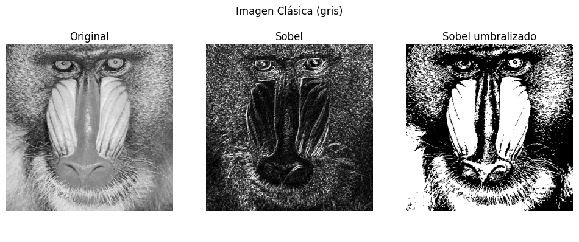
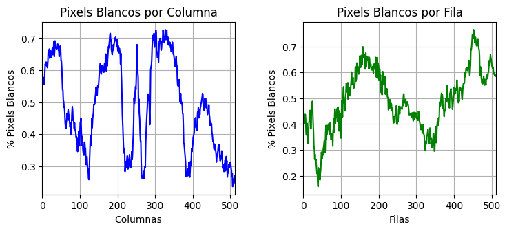
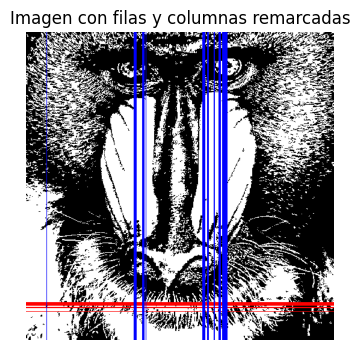
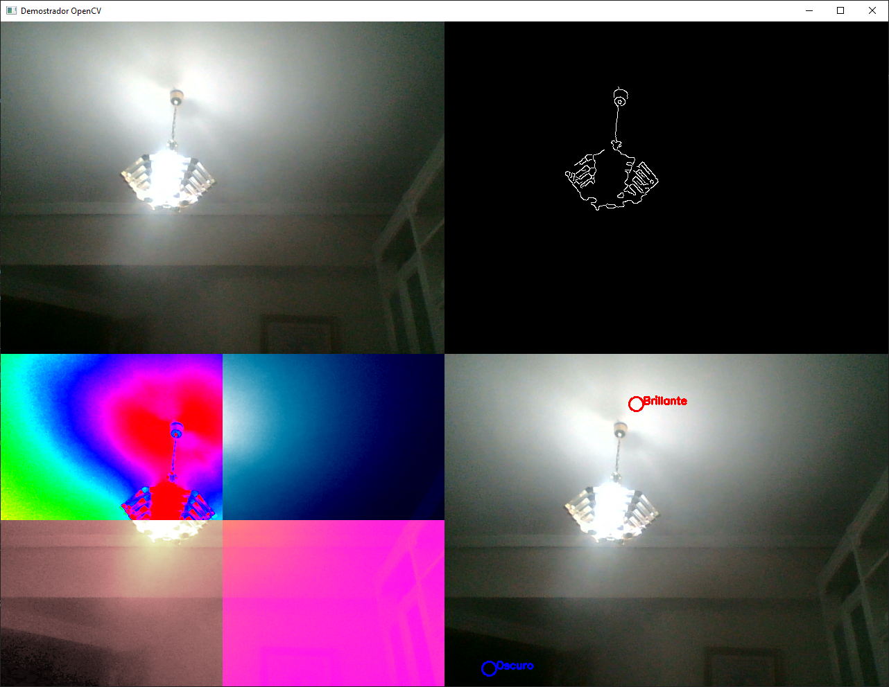

# Práctica 2: Funciones básicas de OpenCV

Este repositorio contiene la **Práctica 2** sobre el uso de **OpenCV** y **NumPy** para el procesamiento de imágenes, donde se exploran tareas como la conversión a escala de grises, la detección de bordes y el análisis de píxeles en imágenes.

## Librerías utilizadas

[](https://numpy.org/)
[](https://opencv.org/)
[](https://matplotlib.org/)

## Autores

Este proyecto fue desarrollado por:

- [](https://github.com/gitfrandu4)
- [](https://github.com/DerKom)

## Tareas

### Tarea 1


### Tarea 2
En este proyecto, aplicamos el operador Sobel a una imagen en escala de grises para detectar sus bordes y luego binarizamos el resultado mediante umbralizado. Los pasos clave fueron:

#### Procesamiento de la Imagen

- Convertimos la imagen a escala de grises y aplicamos un filtro Gaussiano para suavizarla y reducir el ruido.
- Calculamos el gradiente Sobel en las direcciones x e y y combinamos ambos resultados.
- Convertimos el resultado a 8 bits y aplicamos un umbral para obtener una imagen binaria de los bordes.

```python
gris = cv2.cvtColor(img, cv2.COLOR_BGR2GRAY)
ggris = cv2.GaussianBlur(gris, (3, 3), 0)
sobelx = cv2.Sobel(ggris, cv2.CV_64F, 1, 0)
sobely = cv2.Sobel(ggris, cv2.CV_64F, 0, 1)
sobel = cv2.add(sobelx, sobely)
sobel8 = cv2.convertScaleAbs(sobel)
_, sobel8Umbralizado = cv2.threshold(sobel8, 130, 255, cv2.THRESH_BINARY)
```

#### Análisis de Píxeles

- Contamos el número de píxeles blancos por filas y columnas utilizando `cv2.reduce`.
- Normalizamos estos conteos para obtener porcentajes respecto al total.

```python
col_counts = cv2.reduce(sobel8Umbralizado, 0, cv2.REDUCE_SUM)
fil_counts = cv2.reduce(sobel8Umbralizado, 1, cv2.REDUCE_SUM).flatten()
cols = col_counts[0] / (255 * sobel8Umbralizado.shape[0])
filas = fil_counts / (255 * sobel8Umbralizado.shape[1])
```

#### Identificación de Filas y Columnas Significativas

- Calculamos el 95% del valor máximo de los porcentajes obtenidos.
- Identificamos las filas y columnas que superan este umbral.

```python
limiteFila = np.max(filas) * 0.95
limiteColumna = np.max(cols) * 0.95
filas_superiores = np.where(filas >= limiteFila)[0]
columnas_superiores = np.where(cols >= limiteColumna)[0]
```

#### Visualización

- Remarcamos las filas y columnas significativas en la imagen binarizada.
- Observamos que, en comparación con el método de Canny, Sobel es más sensible al ruido y produce bordes menos definidos, mientras que Canny ofrece una detección más precisa.

```python
sobel8Umbralizado_bgr = cv2.cvtColor(sobel8Umbralizado, cv2.COLOR_GRAY2BGR)
for fila in filas_superiores:
    cv2.line(sobel8Umbralizado_bgr, (0, fila), (sobel8Umbralizado_bgr.shape[1]-1, fila), (0, 0, 255), 1)
for columna in columnas_superiores:
    cv2.line(sobel8Umbralizado_bgr, (columna, 0), (columna, sobel8Umbralizado_bgr.shape[0]-1), (255, 0, 0), 1)
plt.imshow(cv2.cvtColor(sobel8Umbralizado_bgr, cv2.COLOR_BGR2RGB))
plt.axis('off')
plt.show()
```

#### Resultado





### Tarea 3

En este proyecto, desarrollé un demostrador que captura imágenes de la cámara web y aplica diferentes funciones de OpenCV para mostrar lo aprendido en las prácticas anteriores. El programa muestra la imagen original junto con tres efectos distintos en una sola ventana.

#### Captura de la Cámara Web:
   - Iniciamos la captura de video desde la cámara web y redimensionamos el frame para facilitar el procesamiento.

#### Efecto de Detección de Bordes (Esquina Superior Derecha):
   - Convertimos el frame a escala de grises y aplicamos un desenfoque Gaussiano para reducir el ruido.
   - Utilizamos el detector de bordes de Canny para resaltar los bordes en la imagen.
   - Convertimos la imagen resultante a BGR para poder combinarla con otros efectos.

   ```python
   # Efecto esquina superior derecha: Canny
   gray = cv2.cvtColor(frame, cv2.COLOR_BGR2GRAY)
   blur = cv2.GaussianBlur(gray, (5, 5), 0)
   edges = cv2.Canny(blur, 50, 150)
   edges_colored = cv2.cvtColor(edges, cv2.COLOR_GRAY2BGR)
   ```

#### Detección de Contraste (Esquina Inferior Derecha):
   - Encontramos los píxeles más brillantes y más oscuros en la imagen en escala de grises.
   - Marcamos estos píxeles en el frame original con círculos y etiquetas.

   ```python
   # Efecto esquina inferior derecha: Detector de contraste
   min_val, max_val, min_loc, max_loc = cv2.minMaxLoc(gray)
   contrastDetector = frame.copy()
   cv2.circle(contrastDetector, min_loc, 10, (255, 0, 0), 2)  # Círculo azul
   cv2.putText(contrastDetector, 'Oscuro', (min_loc[0] + 10, min_loc[1]),
               cv2.FONT_HERSHEY_SIMPLEX, 0.5, (255, 0, 0), 2)
   cv2.circle(contrastDetector, max_loc, 10, (0, 0, 255), 2)  # Círculo rojo
   cv2.putText(contrastDetector, 'Brillante', (max_loc[0] + 10, max_loc[1]),
               cv2.FONT_HERSHEY_SIMPLEX, 0.5, (0, 0, 255), 2)
   ```

#### Efecto Pop Art:
   - Dividimos el frame en cuatro cuadrantes.
   - Aplicamos diferentes mapas de color a cada cuadrante para crear un efecto de arte pop.

   ```python
   # Efecto Pop Art
   height, width, _ = frame.shape
   pop_art = np.zeros_like(frame)
   pop_art[0:height//2, 0:width//2] = cv2.applyColorMap(frame[0:height//2, 0:width//2], cv2.COLORMAP_HSV)
   pop_art[0:height//2, width//2:width] = cv2.applyColorMap(frame[0:height//2, width//2:width], cv2.COLORMAP_OCEAN)
   pop_art[height//2:height, 0:width//2] = cv2.applyColorMap(frame[height//2:height, 0:width//2], cv2.COLORMAP_PINK)
   pop_art[height//2:height, width//2:width] = cv2.applyColorMap(frame[height//2:height, width//2:width], cv2.COLORMAP_SPRING)
   ```

#### Combinación y Visualización:
   - Combinamos la imagen original y los efectos en una sola ventana para mostrar los resultados en tiempo real.
   - Organizamos las imágenes de la siguiente manera:
     - **Arriba:** Imagen original y detección de bordes.
     - **Abajo:** Efecto Pop Art y detección de contraste.

   ```python
   # Combinamos las imágenes
   combined_top = np.hstack((frame, edges_colored))
   combined_bottom = np.hstack((pop_art, contrastDetector))
   combined = np.vstack((combined_top, combined_bottom))
   ```

#### Resultado


### Tarea 4


## Referencias y bibliografía

- OpenCV Documentation: https://docs.opencv.org/
- NumPy Documentation: https://numpy.org/doc/
- Matplotlib Documentation: https://matplotlib.org/stable/contents.html
